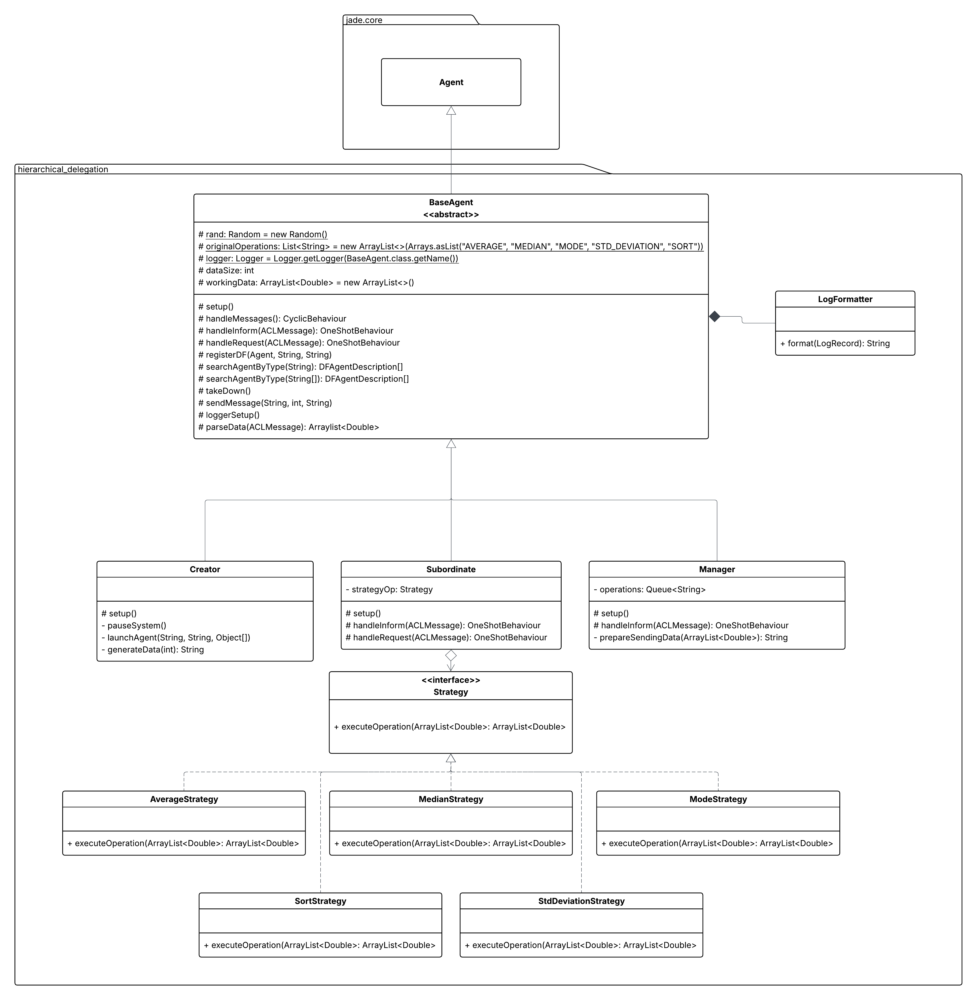
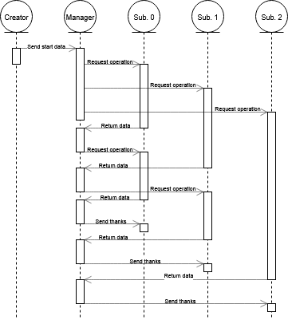
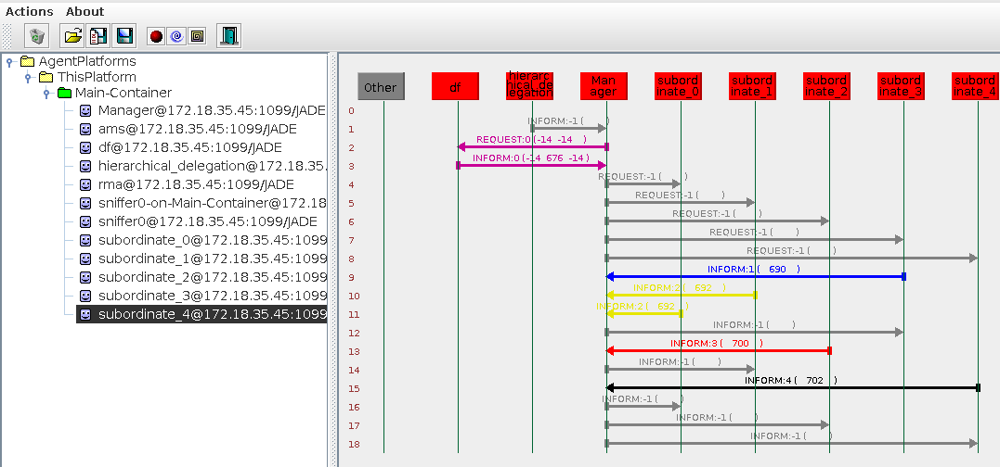
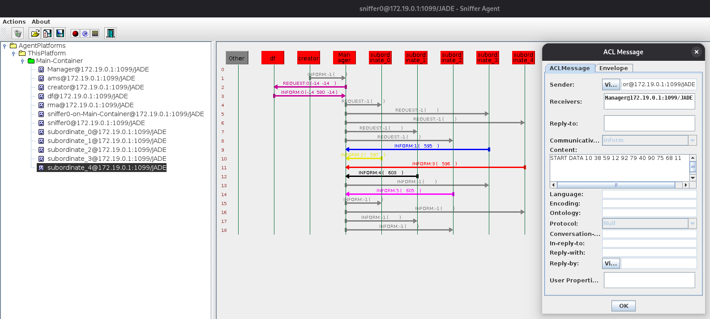
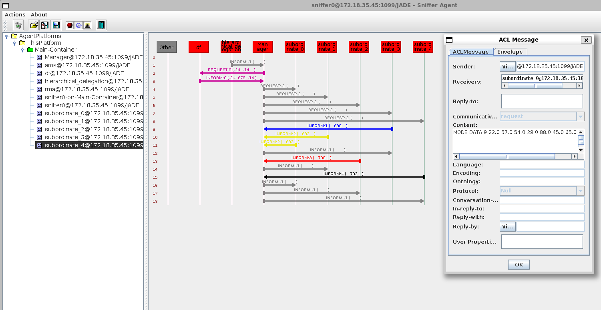

# Estrutura Hierárquica de Delegação

## Autores

| **Identificação** | **Nome** | **Formação** |
| :-: | :-: | :-: |
|  | André Corrêa da Silva | Graduando em Engenharia de Software (UnB) |
|  | Gabriel Mariano da Silva | Graduando em Engenharia de Software (UnB) |

*Tabela 1: Identificação dos Autores*

## Métricas do *Building Block*

[](https://sonarcloud.io/summary/new_code?id=tcc-sma-andre-gabriel_hierarchical-delegation)
[](https://sonarcloud.io/summary/new_code?id=tcc-sma-andre-gabriel_hierarchical-delegation)
[](https://sonarcloud.io/summary/new_code?id=tcc-sma-andre-gabriel_hierarchical-delegation)

[](https://sonarcloud.io/summary/new_code?id=tcc-sma-andre-gabriel_hierarchical-delegation)
[](https://sonarcloud.io/summary/new_code?id=tcc-sma-andre-gabriel_hierarchical-delegation)
[](https://sonarcloud.io/summary/new_code?id=tcc-sma-andre-gabriel_hierarchical-delegation)

[](https://sonarcloud.io/summary/new_code?id=tcc-sma-andre-gabriel_hierarchical-delegation)

## Descrição

O *building block* contido neste repositório tem por objetivo a implementação de uma Estrutura Hierárquica de Delegação, onde o agente responsável pela decisão, representando o "topo da hierarquia", delega aos agentes subordinados, tomando como base para tal decisão a capacidade e disponibilidade de cada um
dos respectivos agentes subalternos, a execução das operações devidas sobre a informação inicial, informando a ele os resultados obtidos.

Inicialmente, o agente *creator*, também responsável por instanciar todo o domínio onde será executado o *building block*, envia uma mensagem solicitando o início das atividades ao agente *manager*, enviando também um conjunto de dados sobre os quais serão aplicadas as operações. O *manager*, tendo recebido a mensagem de início das atividades e o conjunto de dados, começa a enviar, de maneira randômica, uma solicitação de realização de determinadas operações a todos os agentes subordinados disponíveis.

Tendo recebido o conjunto de dados e a operação a ser realizada por parte do agente *manager*, os subordinados executam a requisição demandada e retornam ao *manager* o resultado obtido. Caso todas as operações necessárias tenham sido executadas, o *manager* apenas agradece aos subordinados e finaliza a execução da atividade solicitada. Caso contrário, ele continua demandando aos agentes que já tenham finalizado as operações requisitadas a realização das demais.

## Diagramação

Abaixo, é apresentado o Diagrama de Classes que visa representar a estrutura e organização das classes que compõem o sistema, para além das relações entre estas.



*Figura 1: Diagrama de Classes da Aplicação*

Já abaixo, é apresentado o Diagrama de Sequências, o qual busca apresentar os fluxos de interação e algumas de suas nuances entre todas as classes (instanciadas enquanto agentes) da aplicação desenvolvida.



*Figura 2: Diagrama de Sequências da Aplicação*

## Projeto em Execução

Abaixo, na *Figura 3*, é possível ver o *sniffer* apresentando todos os agentes instanciados para a correta execução do *building block*, contendo o *creator*, o agente *manager* e todos os agentes subordinados, para além do agente *DF*.



*Figura 3: Visualização dos Agentes pelo Sniffer*

Já na *Figura 4*, é possível ver o conteúdo da mensagem de *start* enviada pelo agente *creator* para o *manager*, a qual contém também o conjunto de dados sobre os quais serão executadas todas as operações necessárias.



*Figura 4: Mensagem de *start* com os dados que serão utilizados*

Na *Figura 5*, é apresentada uma representação de uma mensagem enviada pelo *manager* para os agentes subordinados, contendo a operação a ser realizada juntamente do conjunto de dados sobre os quais esta será aplicada.



*Figura 5: Mensagem solicitando a realização de uma operação sobre os dados*

Por fim, é apresentada na *Figura 6* a mensagem enviada de um agente subordinado para o *manager* com o resultado da operação solicitada pelo mesmo sobre os dados recebidos.


*Figura 6: Mensagem informando o resultado operação aplicada sobre os dados*

## Requisitos Técnicos

1. **Identificação de agentes qualificados e disponíveis:** dado um conjunto inicial de dados, o agente responsável, tendo em mente as informações que devem ser retiradas destes, deve ser capaz de identificar um agente subalterno qualificado e disponível para a realização de alguma das operações necessárias;
2. **Delegação de atividades:** tendo identificado um agente que possa ser responsabilizado por uma atividade, o agente responsável deve delegar a este a realização de tal;
3. **Execução das atividades:** tendo recebido uma demanda e o conjunto de dados a ser trabalhado, um agente subalterno deve ser capaz de realizar as operações
necessárias sobre estes dados;
4. **Retorno dos resultados:** uma vez realizada a operação necessária sobre os dados obtidos, o agente subordinado deve retornar ao agente requerente os resultados obtidos.

## Requisitos para Execução

Para a efetiva execução do *building block* disposto no repositório, se faz necessária a instalação e configuração do *software* *Maven* em sua máquina. Para tal, basta seguir as instruções de instalação dispostas na [**documentação do *Maven***](https://maven.apache.org/install.html). Para o desenvolvimento do *building block*, foi utilizado o *Maven* na versão **3.8.7**. Além disso, todas as instruções de execução consideram o uso de sistemas operacionais baseados em *Linux*.

## Como Executar?

Para a execução do *building block*, é possível utilizar-se do *Makefile* adicionado ao repositório ao seguir os seguintes passos:

- Primeiramente, clone o repositório em sua máquina:

```bash
git clone https://github.com/SMA-building-blocks/hierarchical-delegation.git
```

- Em seguida, vá para a pasta do repositório:

```bash
cd hierarchical-delegation
```

- Para realizar a *build* do projeto e executá-lo em seguida, execute o seguinte comando:

```bash
make build-and-run
```

> 🚨 **IMPORTANTE:** Ao executar o projeto, primeiro será realizada a criação de todos os agentes participantes. Logo após, para a efetiva realização do propósito desejado pelo *building block*, é necessário pressionar **ENTER** no terminal para a continuidade da execução do código. Esta decisão foi tomada em prol de uma facilitação do uso do *sniffer* para a visualização da comunicação entre os agentes participantes.

- É possível realizar apenas a *build* do projeto com o seguinte comando:

```bash
make build
```

- Similarmente, é possível rodar o projeto após a geração de sua build com o seguinte comando:

```bash
make run
```

- É possível alterar a quantidade de agentes participantes ao passar a variável **QUORUM** seguida do número desejado, como pode ser visto abaixo (onde N representa o número desejado de agentes):

```bash
make build-and-run QUORUM=N
```

- Por fim, para apagar os arquivos derivados da *build* do projeto, execute o seguinte comando:

```bash
make clean
```

- Para ter acesso a uma série de informações úteis para a execução do building block, basta executar o seguinte comando:

```bash
make help
```

## Referências

[*Jade Project*](https://jade-project.gitlab.io/). <br />
[*Maven*](https://maven.apache.org/).
